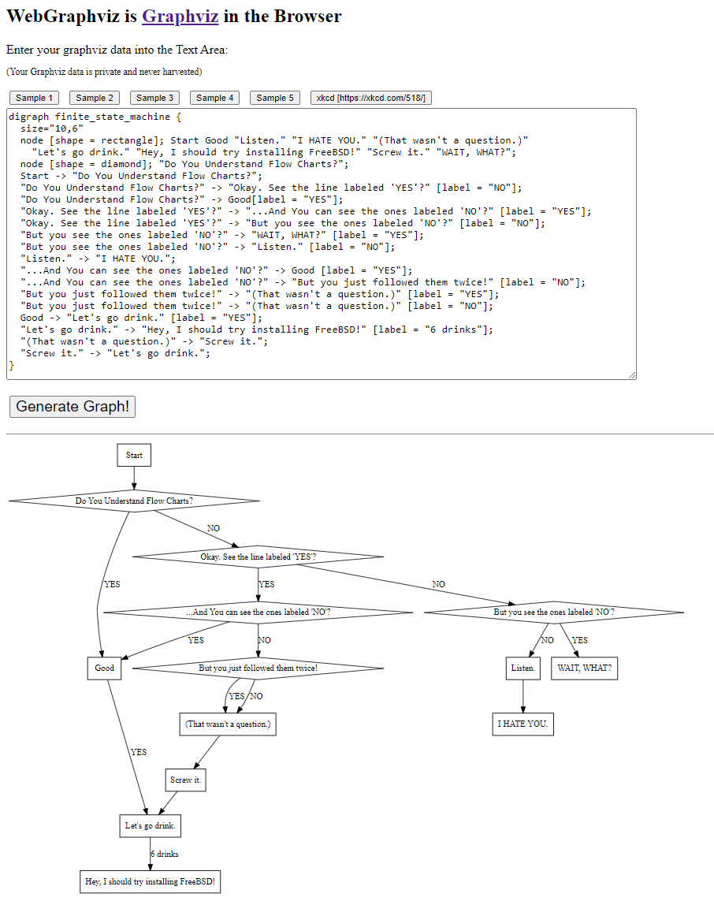

# WebGraphviz is <a href="http://www.graphviz.org/">Graphviz</a> in the Browser

This project uses [Graphviz](http://www.graphviz.org/) built with [Emscripten](http://kripken.github.io/emscripten-site/)
to visualise graphs, defined in [DOT Language](http://www.graphviz.org/doc/info/lang.html), and render them in a browser.

## Documentation
* [Viz.js](https://github.com/mdaines/viz.js)
  * [wiki](https://github.com/mdaines/viz.js/wiki)
  * [API](https://github.com/mdaines/viz.js/wiki/API)
  * [API (1.x)](https://github.com/mdaines/viz.js/wiki/API-(1.x))

## Further information
* [WebGraphviz:  Graphviz in the Browser](https://news.ycombinator.com/item?id=16077158)
* [A Guide to Understanding Flow Charts  Presented in Flow Chart Form](https://xkcd.com/518/)

## Alternatives
* [Graphviz online](https://dreampuf.github.io/GraphvizOnline/)
* [Dagre](https://dagrejs.github.io/)
* [graphlib](https://github.com/dagrejs/graphlib)

## Acknowledgements
Largely based on code stolen from:
* http://webgraphviz.com/

